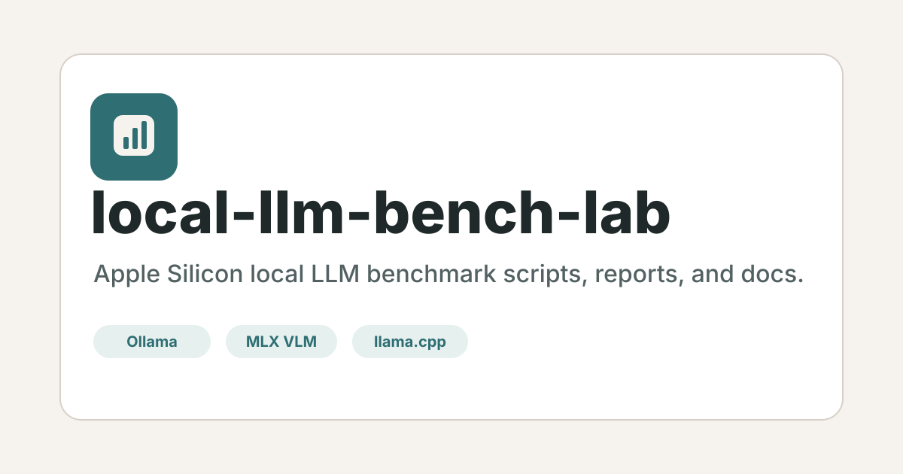

<p align="center">
  
</p>

# local-llm-bench-lab

Apple Silicon local LLM benchmark lab for recording repeatable model runs across Ollama, MLX VLM, and llama.cpp.

<p>
  <a href="README.ja.md">日本語</a> |
  <a href="https://sunwood-ai-labs.github.io/local-llm-bench-lab/">Docs</a> |
  <a href="https://github.com/Sunwood-ai-labs/local-llm-bench-lab">GitHub</a>
</p>

<p>
  <a href="https://github.com/Sunwood-ai-labs/local-llm-bench-lab/actions/workflows/ci.yml"></a>
  <a href="https://github.com/Sunwood-ai-labs/local-llm-bench-lab/actions/workflows/deploy-docs.yml"></a>
  <a href="LICENSE"></a>
</p>

## ✨ What This Is

This repository keeps local LLM benchmark scripts, experiment reports, and lightweight result files in one reusable shape. It started with a Gemma 4 experiment on an Apple M1 Max machine, but the structure is intentionally model-agnostic so more Llama, Qwen, Phi, Mistral, or other local model runs can be added later.

The repo tracks reproducible scripts and compact benchmark artifacts. Large local model files, virtual environments, Hugging Face caches, raw logs, and full experiment backups stay outside Git through `.gitignore`.

## 🚀 Quick Start

Set up Python helpers:

```sh
python3 -m venv .venv
source .venv/bin/activate
python3 -m pip install -r requirements.txt
```

Run an Ollama benchmark:

```sh
scripts/ollama_bench.sh gemma4:e2b
```

Run an MLX VLM benchmark:

```sh
scripts/mlx_vlm_bench.py \
  --model artifacts/models/mlx-community-gemma-4-e2b-it-4bit \
  --out benchmarks/mlx-vlm-run.jsonl
```

Run an MLX VLM server benchmark:

```sh
MODEL=artifacts/models/mlx-community-gemma-4-e2b-it-4bit \
scripts/mlx_vlm_server_bench.sh
```

Use `.env.example` as a reference for local settings. `.env` is intentionally ignored.

Launch the desktop speed lab:

```sh
cd apps/llm-speed-desktop
npm install
npm run tauri dev
```

The Tauri app turns the report table into runnable presets for Ollama, MLX VLM server, and llama.cpp `llama-bench`.

## 📊 First Experiment

The initial dataset is under `experiments/gemma4-2026-04-29/`:

- `reports/Gemma4_Local_LLM_Report_JA.md`: Japanese experiment report
- `reports/raw_setup_and_bench_log.md`: setup and measurement notes
- `benchmarks/`: JSONL, TSV, and compact JSON result files
- `FULL_COPY.md`: notes about the local full-copy backup

Representative result from the report:

| Runtime | Model | Generation speed | Notes |
|---|---:|---:|---|
| Ollama | `gemma4:e2b` | ~70 tok/s | fastest daily-use path in the experiment |
| Ollama | `gemma4:26b` | ~36 tok/s | larger sparse MoE, still practical |
| MLX VLM server | E2B 4-bit | ~70-76 tok/s | persistent server with KV cache 8-bit |
| llama.cpp | E4B GGUF | ~38.5 tok/s | Metal backend, close to Ollama E4B |

See the full report for machine details, caveats, and raw command context.

## 🧭 Repository Layout

```text
benchmarks/                         Cross-experiment summaries
configs/                            Model and backend configuration notes
docs/                               VitePress documentation site
experiments/gemma4-2026-04-29/      Initial Gemma 4 experiment
scripts/                            Reusable benchmark scripts
tools/                              Helper utilities
artifacts/                          Local generated assets, ignored when heavy
apps/llm-speed-desktop/             Tauri desktop app for interactive speed checks
```

## 🛡 Data Policy

Keep these out of Git:

- model weights such as `.gguf`, `.safetensors`, `.bin`, `.pt`, `.onnx`
- `models/`, `hf-cache/`, and local Hugging Face caches
- Python virtual environments
- runtime logs and temporary download chunks
- `experiments/*/full-copy/`

Track compact benchmark evidence instead: JSONL, TSV, small JSON summaries, reports, scripts, and reproducibility notes.

## 📚 Documentation

The documentation site lives in `docs/` and is published with GitHub Pages:

```sh
cd docs
npm ci
npm run docs:build
```

Local preview:

```sh
npm run docs:dev
```

## 🤝 Contributing

Contributions are welcome when they keep benchmark runs reproducible and the repository lightweight. Start with `CONTRIBUTING.md`, use the issue templates for new benchmark reports, and avoid committing heavyweight model artifacts.

## 📄 License

This repository is released under the MIT License. See `LICENSE`.
